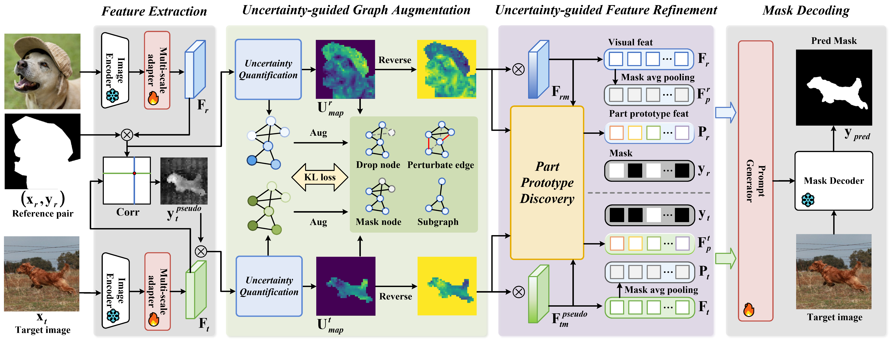

# UNICL-SAM: Uncertainty-Driven In-Context Segmentation with Part Prototype Discovery
[Dianmo Sheng](https://github.com/ImmortalSdm/)<sup>1</sup>, [Dongdong Chen](https://www.dongdongchen.bid/)<sup>2</sup>, [Zhentao Tan](https://scholar.google.com/citations?user=VCX7itEAAAAJ&hl=zh-CN)<sup>1</sup>, [Qiankun Liu](https://scholar.google.com/citations?user=TNDbzzMAAAAJ&hl=zh-CN)<sup>3</sup>, [Qi Chu](http://staff.ustc.edu.cn/~qchu/)<sup>1</sup>, [Tao Gong](https://scholar.google.com.hk/citations?user=_JhW9D0AAAAJ&hl=zh-CN)<sup>1</sup>, [Bin Liu](https://scholar.google.com/citations?user=kReWULQAAAAJ&hl=en)<sup>1</sup>, Jing Han<sup>4</sup>, Wenbin Tu<sup>4</sup>, [Shengwei Xu](https://openreview.net/profile?id=~Shengwei_Xu1)<sup>5</sup>, [Nenghai Yu](https://scholar.google.com/citations?user=7620QAMAAAAJ&hl=zh-CN)<sup>1</sup>,

<sup>1</sup>University of Science and Technology of China, <sup>2</sup>Microsoft GenAI, <sup>3</sup>University of Science and Technology Beijing, <sup>4</sup>BoCom Research, <sup>5</sup>Beijing Electronic Science and Technology Institute

<div align=center>

</div>

[[Paper](https://openaccess.thecvf.com/content/CVPR2025/papers/Sheng_UNICL-SAM_Uncertainty-Driven_In-Context_Segmentation_with_Part_Prototype_Discovery_CVPR_2025_paper.pdf)] 

</div>

## Environment Setup
```
conda create --name unicl-sam python=3.10 -y
conda activate unicl-sam
pip install torch==2.1.0 torchvision==0.16.0 torchaudio==2.1.0 --index-url https://download.pytorch.org/whl/cu118
pip install -r requirements.txt
```
## Data Preparation
1. Download training and evaluation datasets COCO-20i, FSS1000, LVIS-92i like below:
    1.1 COCO-20<sup>i</sup>

    > Download COCO2014 train/val images and annotations: 
    > ```bash
    > wget http://images.cocodataset.org/zips/train2014.zip
    > wget http://images.cocodataset.org/zips/val2014.zip
    > wget http://images.cocodataset.org/annotations/annotations_trainval2014.zip
    > ```
    > Download COCO2014 train/val annotations from this Google Drive: [train2014.zip](https://drive.google.com/file/d/1cwup51kcr4m7v9jO14ArpxKMA4O3-Uge/view?usp=sharing), [val2014.zip](https://drive.google.com/file/d/1PNw4U3T2MhzAEBWGGgceXvYU3cZ7mJL1/view?usp=sharing). (and locate both train2014/ and val2014/ under annotations/ directory).

    1.2 FSS-1000

    > Download FSS-1000 images and annotations from this [Google Drive](https://drive.google.com/file/d/1Fn-cUESMMF1pQy8Xff-vPQvXJdZoUlP3/view?usp=sharing).

    1.3 LVIS-92<sup>i</sup>

    > Download COCO2017 train/val images: 
    > ```bash
    > wget http://images.cocodataset.org/zips/train2017.zip
    > wget http://images.cocodataset.org/zips/val2017.zip
    > ```
    > Download LVIS-92<sup>i</sup> extended mask annotations from our Google Drive: [lvis.zip](https://drive.google.com/file/d/1itJC119ikrZyjHB9yienUPD0iqV12_9y/view?usp=sharing).

2. Download data splits from [[HSNet](https://github.com/juhongm999/hsnet/tree/main/data/splits)]

3. Modify the data path corresponding to unicl_sam/data/data_setting.py

## Train UNICL-SAM
1. Download [[SAM-H checkpoint](https://dl.fbaipublicfiles.com/segment_anything/sam_vit_h_4b8939.pth)] and modify the SAM path corresponding to the config under the configs/unicl_sam path

```
sh train.sh
```

## Evaluate UNICL-SAM
Test with specific device, model and ckpt
```
sh test.sh DEVICE EXP_DIR CKPT_PATH
```

## Acknowledgement
Many thanks to these excellent opensource projects
* [Segment Anything](https://github.com/facebookresearch/segment-anything)  

## Citation
If you find this project useful for your research, please use the following BibTeX entry.
```bibtex
@inproceedings{sheng2025unicl,
  title={UNICL-SAM: Uncertainty-Driven In-Context Segmentation with Part Prototype Discovery},
  author={Sheng, Dianmo and Chen, Dongdong and Tan, Zhentao and Liu, Qiankun and Chu, Qi and Gong, Tao and Liu, Bin and Han, Jing and Tu, Wenbin and Xu, Shengwei and others},
  booktitle={Proceedings of the Computer Vision and Pattern Recognition Conference},
  pages={20201--20211},
  year={2025}
}
```